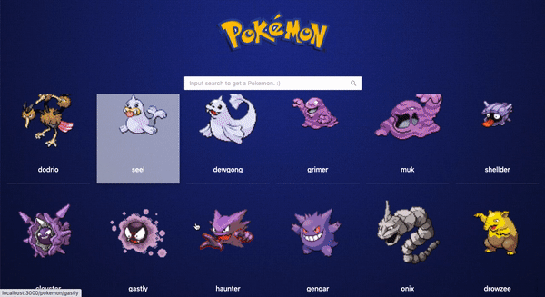
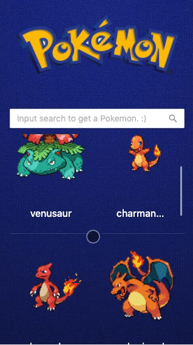
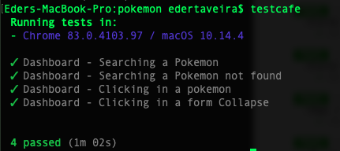

# Pokemon

This project is a web app that lists Pokemons. It allows us to search and get details from each one.

You can see the project running in production mode: [https://pokechallenge.herokuapp.com/](https://pokechallenge.herokuapp.com/)

## Screenshots

### Desktop Perspective


### Mobile Perspective


## Libraries

- axios - API Access.
- react-helmet - SEO Handling.
- react-loadable - Page Loading.
- redux - Global State handling.
- redux-persist - Redux Midleware.
- react-router-dom - Routes handling.
- react-icons - Icons lke FA.
- testcafe - E2E Tests.

## Getting Started

To Config the Environment variables:

- _REACT_APP_endpoint (https://pokeapi.co/api/v2/)
- _NODE_ENV_ (development) - Optional, used more when online deploy.

### Prerequisites

1. NodeJS/npm previously installed.

### Dependences install

```yarn```
or
```npm install```

## Tests


### Installing testcafe as global library:
```
npm install -g testcafe
```

### Running the test cases
```
testcafe
```

You'll see something like that in the end:



In the case that you need to run the tests in production or online environment, you can set the env variable **TEST_CAFE_HOME_PAGE**.

## Running the Project

```
yarn start
```

## Built using

- [ReactJS](https://pt-br.reactjs.org/) - Front-end Library.
- [Ant Design](https://ant.design/) - React UI library.
- [API Pokemon](https://pokeapi.co/)

## Author

- **Eder Taveira** - [edertaveira](https://github.com/edertaveira)

## Licence

This project is protected by [Invillia](https://invillia.com/global-growth-framework/).
